# Nordic SDK Docker Environment


This repository provides a Docker-based development environment for building Zephyr-based applications for Nordic Semiconductor's nRF54 series (e.g., `nrf54l15dk/nrf54l15/cpuapp`).

---

## 📚 Table of Contents

1. [🚀 Quick Start](#-quick-start)
2. [📁 Project Directory Structure](#-project-directory-structure)
3. [🔧 Build the Application](#-build-the-application)
4. [🔌 Flash the Device](#-flash-the-device)
5. [📎 Notes](#-notes)
6. [🛠 Requirements](#-requirements)
7. [🧾 License](#-license)
8. [👤 Author](#-author)

---

## 🚀 Quick Start

### 1. Build the Docker Image

```bash
docker build --platform=linux/amd64 -t custom-nrf-sdk .
```

### 2. Run the Container

```bash
docker run --platform=linux/amd64 -it -v $(pwd):/workdir/project custom-nrf-sdk
```

This mounts your current directory into the container at `/workdir/project`.

---

### 3. Initialize the Environment
Once inside the container, run the following command to initialize the environment:
```bash
bash init.sh
```

## 📁 Project Directory Structure

Inside the container, navigate to your app directory:

```bash
cd /workdir/project/zephyrproject/app
```

---

## 🔧 Build the Application

Use `west` to build the firmware for the target board:

```bash
west build -b nrf54l15dk/nrf54l15/cpuapp
```

---

## 🔌 Flash the Device

Exit the container, then run the following on your host machine (from the `app` directory):

```bash
nrfjprog --program build/merged.hex --chiperase --reset
```

> Ensure that [nRF Command Line Tools](https://www.nordicsemi.com/Products/Development-tools/nRF-Command-Line-Tools) are installed and your debugger is connected.

---

## 📎 Notes

- This setup uses the `linux/amd64` platform explicitly for compatibility with Zephyr SDK.
- Build artifacts are retained on the host system due to the volume mount (`-v $(pwd):/workdir/project`).

---

## 🛠 Requirements

```mermaid
flowchart TD
    subgraph Host
        H1["💻 Host System (Mac/Linux/Windows)"]
        VSC["🧠 VS Code (Dev Container)"]
        Flash["🔌 J-Link Flash Tool (runs on host)"]
        DockerEngine["🐳 Docker Engine"]
        DevVolume["💾 Project Volume (/workdir/project)"]
    end

    subgraph Container
        C1["📦 Docker Image: custom-nrf-sdk"]
        West["🛠️ west CLI"]
        SDK["📚 Zephyr SDK v0.16.4"]
        Toolchain["🔧 arm-zephyr-eabi toolchain"]
        PythonDeps["🐍 pyelftools + intelhex"]
        BuildCmd["🏗️ west build -b nrf54l15dk_nrf54l15_cpuapp app"]
        Artifact["📄 merged.hex / zephyr.elf"]
    end

    VSC --> C1
    DevVolume --> C1
    DockerEngine --> C1
    C1 --> BuildCmd --> Artifact
    Artifact --> DevVolume --> Flash

    Flash --> N1["Note: Flashing is done on host due to USB passthrough limitations in Docker."]
```



---

## 🧾 License

MIT or your preferred license here.

---

## 👤 Author

**Shubhendra Singh**  
[Contact me](mailto:shubhendra.singh@wheelseye.com)
&nbsp;

[ LinkedIn](https://www.linkedin.com/in/shubhendra-pratap-singh-123504180/)

---

Happy Building! ⚙️🧠
